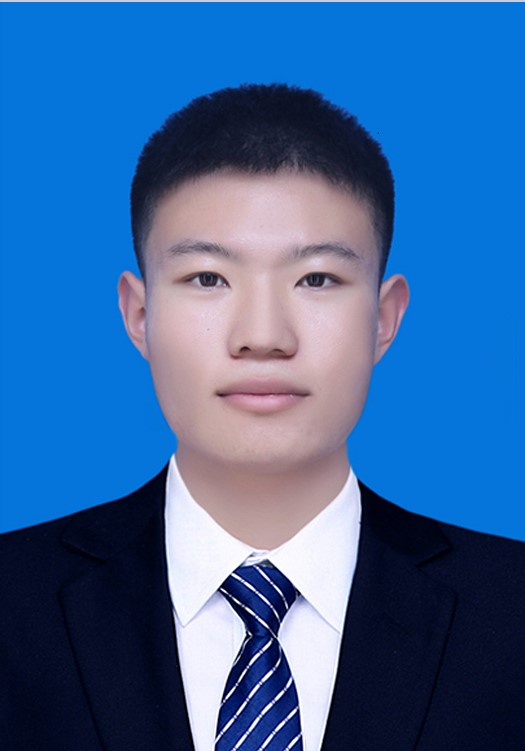

# 李黎明 
 Email: [liliming@sia.cn](https://blog.csdn.net/quintind/article/details/79370427) &nbsp;&nbsp;&nbsp;&nbsp;&nbsp;&nbsp;&nbsp;&nbsp;&nbsp;&nbsp;&nbsp;&nbsp; Tel:  +86 15651796312    **地址**：河南省开封市尉氏县大马乡八里庙村

 **教育经历** 
***
**中科院沈阳自动化研究所**  2021/03-2023/06  **专业：** 机械电子工程 &nbsp; **学位：** 硕士（预计） 

**中国科学技术大学**  2020/09-2021/01  **专业：** 自动化 &nbsp;&nbsp;&nbsp;&nbsp; **学位：** 无（代培研究生） 

**南京航空航天大学**  2016/09-2020/06  **专业：** 自动化 &nbsp;&nbsp;&nbsp;&nbsp; **学位：** 学士 &nbsp;&nbsp;&nbsp;&nbsp;  GPA：4.1/5.0  

 **项目经历** 
***
**基于U-Net的XXX**  2021/04-2021/07  课题组项目  将深度学习引入课题相关的信号处理领域，充分利用分割网络U-Net的特性满足项目中的相关需求，其中特征提取部分采取了短时傅里叶变换(STFT)，将变换之后的特征图作为网络输入，获取预期输出。

**复杂海况下非合作海面目标视觉检测与跟踪**  2020/01-2020/06  独立毕业设计 **南京航空航天大学校级优秀毕设**  对海面场景中常用的传统目标检测和跟踪方法进行改进，在霍夫变换的基础上引入加权算法，实现了**海天线的精准定位**，大大提高了检测效率和准确率，系统具有较强的实时性。

**面向宇航员肌力训练的外骨骼机器人研究**  2019/04-2020/06  主要参与 **国家级大学生创新训练计划项目，结题优秀**  负责机器人整机程序的开发，协调软件和硬件设计。机器人通过陀螺仪联合足底的压力传感器和绑缚在小腿上的力传感器实现对穿戴者步态的识别。通过引入导纳控制和阻抗控制的控制策略，保证了人机交互的舒适性和流畅度，整机体验效果良好[(Video)](https://www.bilibili.com/video/BV19C4y187NT?spm_id_from=333.999.0.0)。同时依托该项目提交两项发明型专利，第一次审查意见通知书已送达。

**基于STM32的送药巡诊医疗机器人**  2019/05-2019/09  负责人 **中国机器人大赛医疗服务机器人赛项二等奖，中国·青岛**  负责项目整体统筹规划，个人主要完成了最核心的机器人定位与导航部分。通过结合陀螺仪和编码器数据构建了机器人在动态地图中的自主导航与定位系统，最终定位误差缩小至0.1%。改进后的作品在2019年江苏省机器人大赛中获得亚军，该作品后参加2020年中国机器人大赛并成功夺得亚军。

**桌面级微小卫星姿态控制与仿真系统**  2019/01-2019/05  负责人 **南京航空航天大学校级自由探索项目，结题优秀**  负责项目整体统筹规划，把控硬件开发进度和软件系统协调开发。个人主要负责PC端应用程序（卫星地面站）开发和硬件端卫星动量轮控制部分的工作，其中桌面程序基于C#开发，可以通过蓝牙串口与卫星实现实时数据传输和指令传输。通过对动量轮的角速度、角加速度进行控制实现卫星姿态的控制。

**基于STM32的智能环境探测小车**  2018/11-2018/12  负责人 **校电子电路设计竞赛一等奖**  主要负责上位机程序编写(图像接收与显示)和下位机STM32程序整合以及基于OV7670摄像头的图像采集和图像信息处理，用于火灾警情的发现以及场景的实时回传。

**基于人脸识别的表情输入及检索系统**  2017/04-2018/05  主要参与 **省级大学生创新训练计划项目，结题良好**  负责Android端程序开发，通过摄像头获取用户信息并分析用户情绪，利用情绪数据完成两项功能 1) 搜索Emoji 表情以及在线表情包；2)利用表情序列加解密。

**基于Kinect的动作投影武术机器人**  2017/04-2018/05  主要参与 **江苏省机器人大赛，季军**  利用Kinect实现对三维人体模型的建立，经过上位机关节角度计算通过WiFi发送至Arduino 控制机器人各个关节舵机，从而实现机器人对人动作的模仿。本作品有三个版本：1)双足机器人；2)可变形机器人，可变为车与人两个形态；3)履带式机器人。

 **工作经历** 
***
**Python算法工程师**
实习 三一重能股份有限公司
同风电项目组合作，完成其风电设备监测数据的实时处理，所开发算法可以及时发现出现故障的设备并给出设备的位置信息，方便现场工作人员进行快速检修和维护。

 **荣誉奖项** 
***
瑞华筑梦奖学金(6/5000) 2020 
  
国家奖学金(6/800) 2019 
  
国家励志奖学金 2017&2018 
  
南京航空航天大学“优秀学生干部” 2018 
  
校本科生学术论坛“院级优秀论文”三篇，第一作者两篇 2018 
  
南京航空航天大学“三好学生”(6/5000) 2017 
  
校级社会实践优秀团队 2017 
  
“颂祖国·献礼十九大”创作大赛特等奖 2017 
